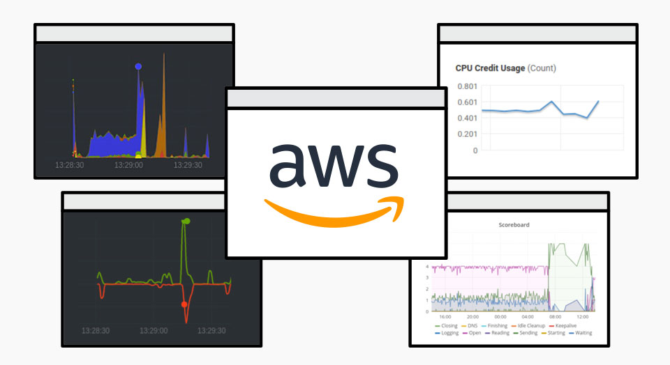
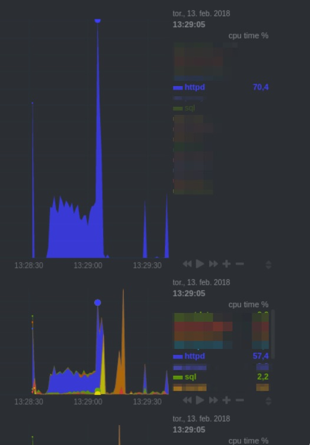
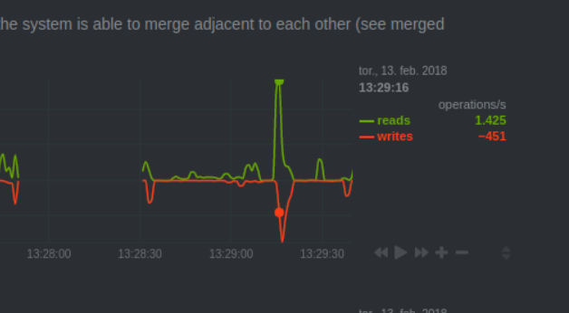
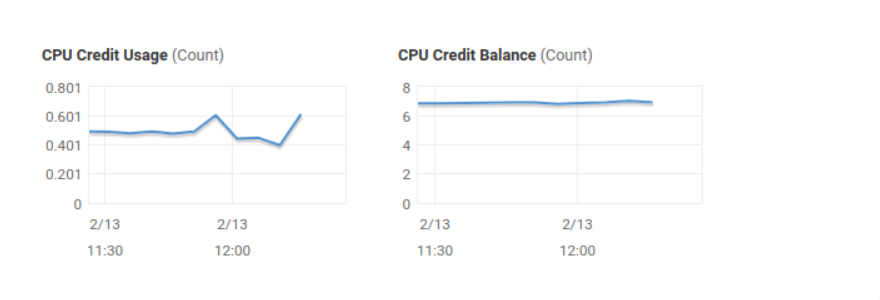
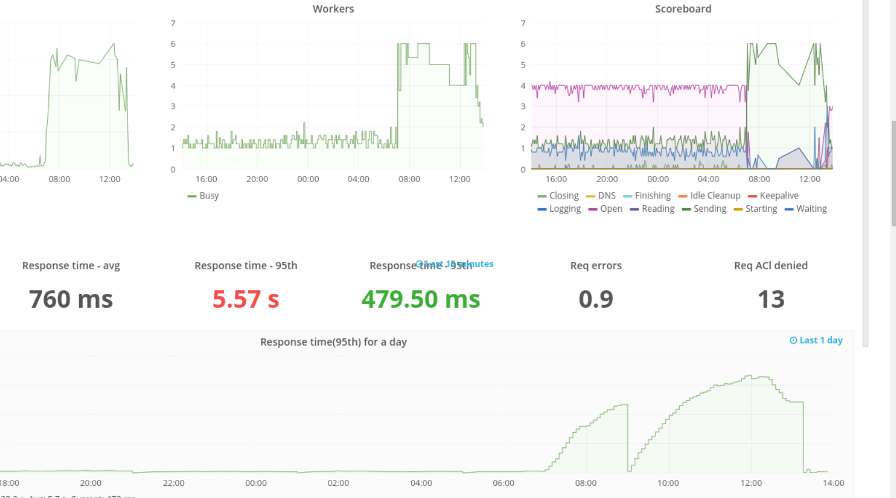
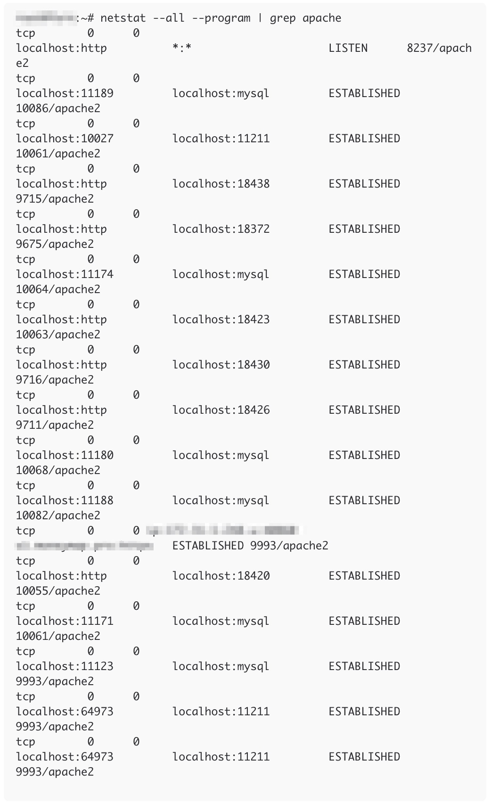

Lately, AWS has been giving us a lot of headaches on the Easy Blog Networks project. It turns out only because resources (we pay per how many things we can do per second) are fiercely measured on AWS, but the underlying problems are happening on all EBN providers. So when we go over operations per second limit which is 100, the EC2 hypervisor will limit entire server by lowering CPU resources. We see that as CPU steal. Now in order to figure out what exactly is using more than 100 operations per second, I installed netdata on a few servers. Which gave me the following picture:


In above picture we can see enormous spike in CPU usage by group of apache2 servers.


We had ~1.8k I/O operations(read,open,mmap syscalls), the limit is 100. And we still had a lot of credits to spare.


But AWS has this thing called burstable limit: you can have 100OP per second but you can also spike over that limit (3000 in our case). The burst is limited to 5-seconds moving average window if instance does not lower usage in that timespan, entire instance is punished by taking away CPU resources. One can disable this behavior on all x2 instances (Enable T2 unlimited), but this will incur additional costs, if you have constant usage above limits and not just spikes.

Now what that means is that some scripts are doing more things than anything else (backups don’t even come close to this). Tracking it down I came to something running mysql query:



The process was up for almost 5 minutes, where it can only be up for 90 seconds. To get things in order I limited MySQL runtime from 28k seconds which is the default, to 30 seconds.

```
[mysqld]
interactive_timeout=30
wait_timeout=30
connect_timeout=30
This is after the lowered runtime limit was applied:
```


I’m still tracking down what exactly is causing extremely expensive queries because when the server gets spanked by AWS, every query is considered “costly” and then no monitoring helps. But if we catch it just before it happens, we have the culprit! 🙂

### Originally posted at [https://blog.niteo.co/aws-ec2-gotchas/ ](https://blog.niteo.co/aws-ec2-gotchas/)
