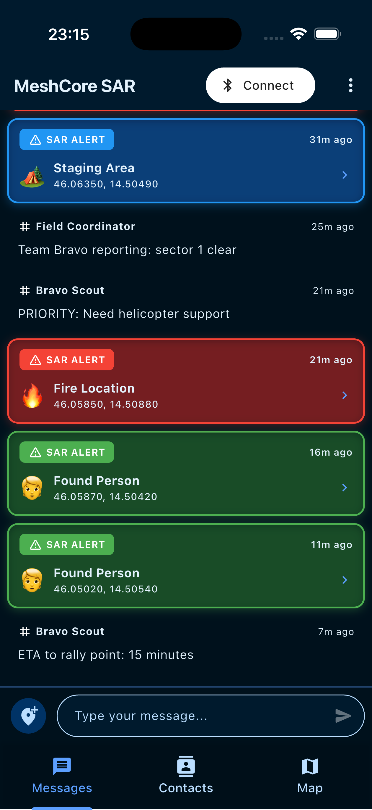
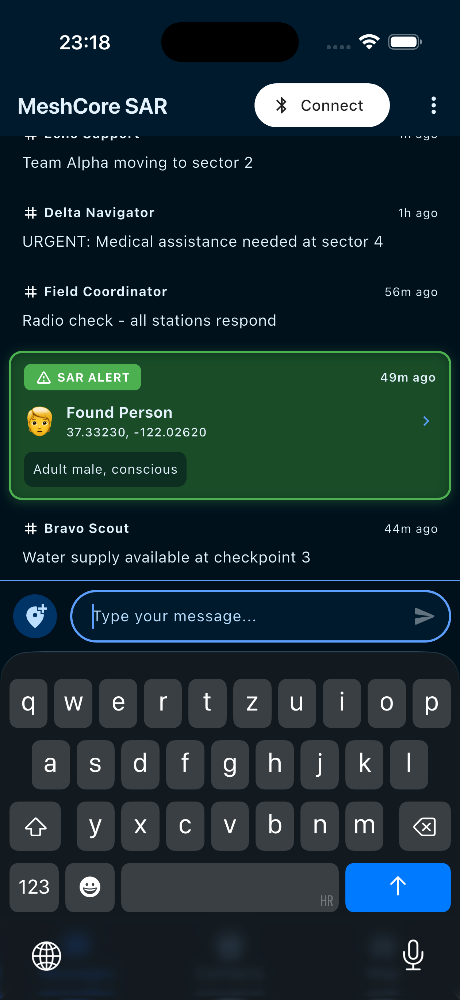
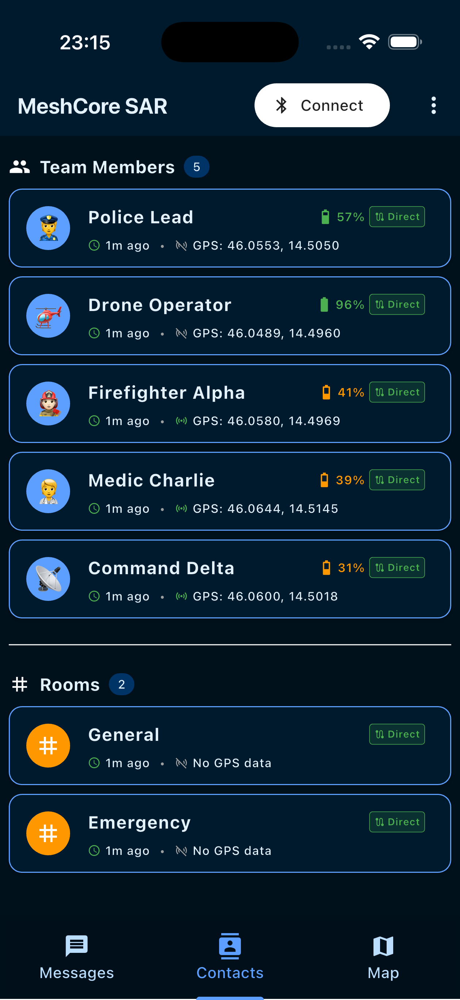
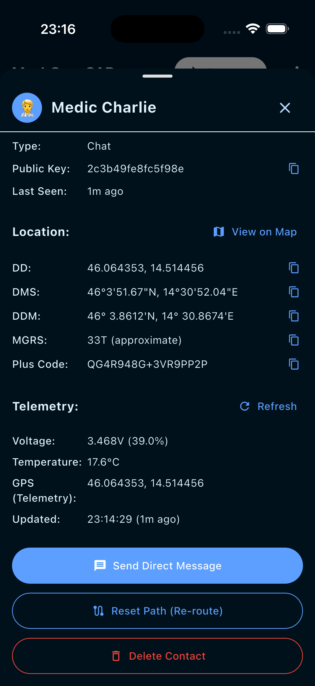
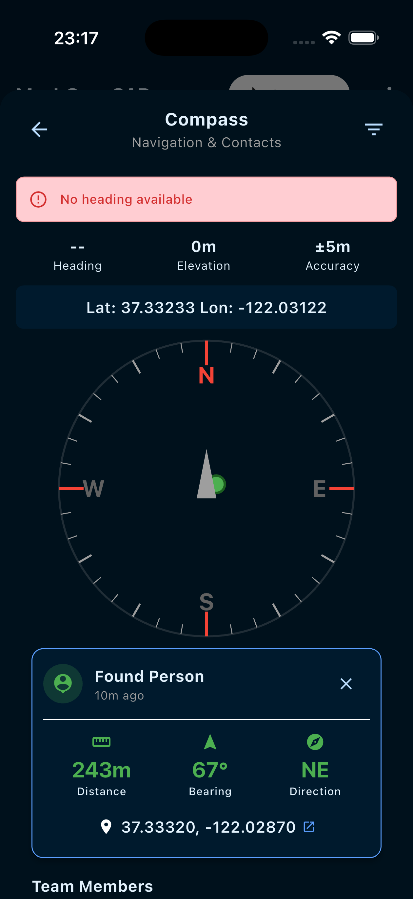
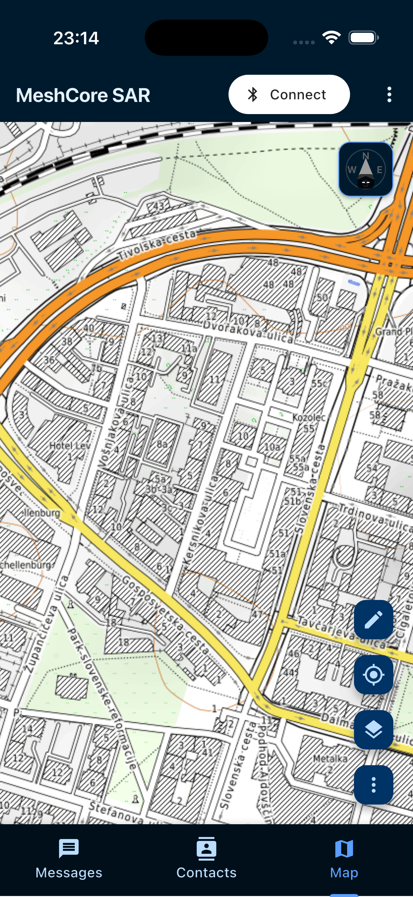
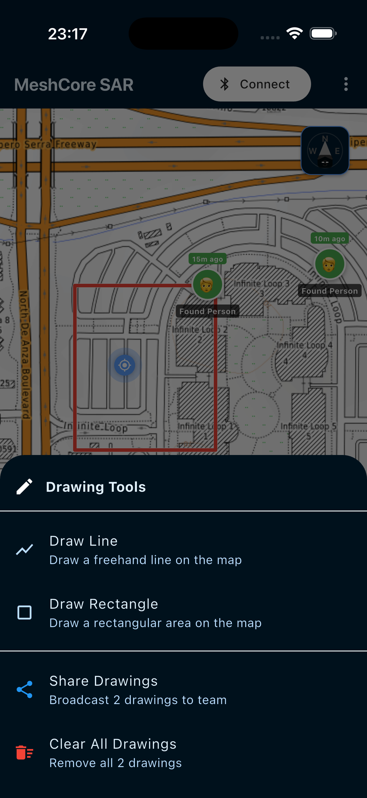
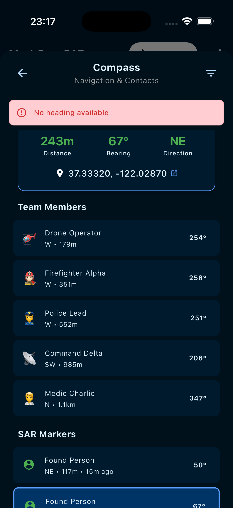

## Overview

**MeshCore SAR** transforms ordinary smartphones into **off-grid communication tools**.  
It provides **messaging, GPS tracking, and tactical mapping** even when cellular and internet infrastructure fail. It uses MeshCore network and devices to do so.

---

## LoRa & MeshCore Technology

**LoRa (Long Range)** enables secure, ultra-low-power communication over kilometers.  
**MeshCore Protocol** extends this by creating a **self-healing, multi-hop mesh** .

- **Automatic routing & fallback** through other devices  
- **Adaptive location broadcasting** — only updates when needed  
- **Message persistence & retries** with ACK confirmation  
- **Optimized for battery life**

> MeshCore SAR ensures your message always finds its path — even across mountains or disaster zones.

---

## Hardware & Infrastructure

**MeshCore SAR requires MeshCore devices** to transmit data over the LoRa mesh network.  
The app connects to these devices via Bluetooth, transforming your smartphone into a mesh communication terminal.

### MeshCore Device Options
- **Dedicated MeshCore nodes** — purpose-built for field deployment  
- **Existing repeaters** — leverage installed infrastructure  
- **Client devices** — other team members' MeshCore units  
- **Room nodes** — persistent communication hubs  

> **Seamless Integration**: MeshCore SAR works with any existing MeshCore network — no separate infrastructure needed.

Whether you're extending an established mesh or starting fresh, every MeshCore device becomes part of your resilient communication backbone.

---

## Messages

  

    <h4>Messages View</h4>
    
  

  

    <h4>Send SAR Marker</h4>
    
  

  

    <h4>SAR Alerts Feed</h4>
    
  

### Mission Communication
- **Direct Messages** – private one-to-one communication  
- **Public Channels** – broadcast updates across nodes  
- **Rooms** – persistent logs (e.g., *General*, *Emergency*)  

### SAR Marker Messages
Easily send geo-tagged alerts:  
*Found Person* • *Fire Location* • *Staging Area* • *Object Found*

Messages appear instantly on the map with delivery tracking (Sent / Delivered / Retrying / Failed).

---

## Contacts

  

    <h4>Team List</h4>
    
  

  

    <h4>Contact Details</h4>
    
  

  

    <h4>Compass View</h4>
    
  

### Situational Awareness
- Real-time **GPS**, **bearing**, and **distance** to each member  
- **Battery telemetry** and **voltage readings**  
- **Routing path** indicator (Direct / Multi-hop / Flood)  
- **Role badges** for clarity (Police, Firefighter, Medic)  
- Compass shows direction and proximity of all contacts and SAR markers  

---

## Map

  

    <h4>Tactical Map</h4>
    
  

  

    <h4>Drawing Tools</h4>
    
  

  

    <h4>Compass Navigation</h4>
    
  

### Tactical Display
- **Offline vector maps (MBTiles)** with street, topo, and satellite layers  
- **SAR event markers** — color-coded by type  
- **Drawing tools** for quick visual planning (lines, rectangles, zones)  
- **Compass integration** — precise direction and range to any object or person  

You can Plan, navigate, and execute — all offline.

---

## Download

Get MeshCore SAR for your device:

**iOS (TestFlight Beta)**  
[Download for iOS](https://testflight.apple.com/join/HhzerdHp)

**Android**  
[Download APK](https://drive.google.com/file/d/1vuwh65CTBTLrj4HXJBa4nSXxcHicUcN0/view?usp=sharing)
