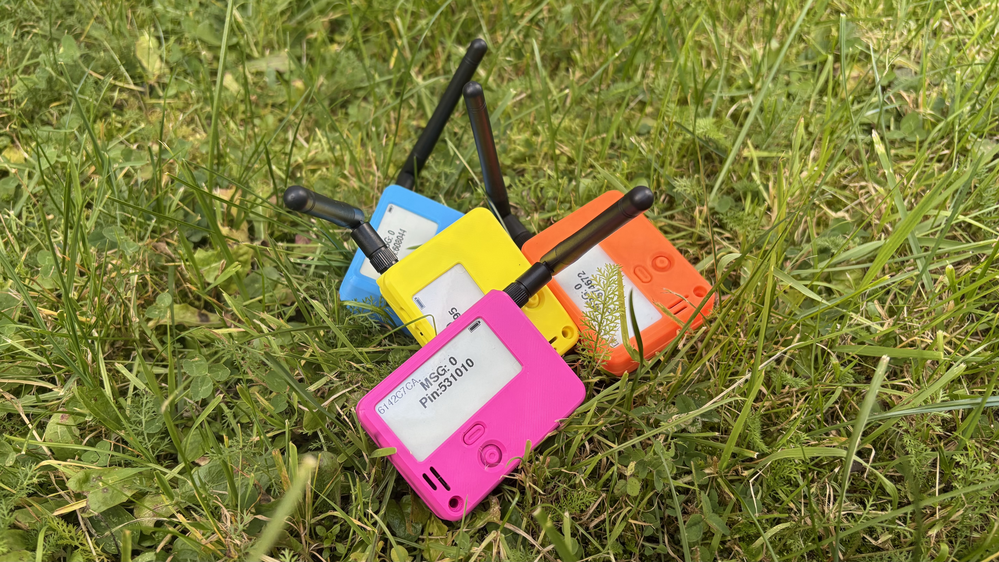
## Overview

**MeshCore SAR** turns ordinary smartphones into a practical **off-grid coordination tool** for search and rescue teams.  
Paired with MeshCore radios, it delivers **messaging, GPS tracking, and tactical mapping** when cellular service and internet access are unavailable.

---

## Hardware & Infrastructure

**MeshCore SAR requires MeshCore devices** for LoRa transport.  
The app connects to those devices over Bluetooth and turns a smartphone into a field terminal for communication, location sharing, and navigation.

### MeshCore Device Options
- **Dedicated MeshCore nodes** — purpose-built for field deployment  
- **Existing repeaters** — leverage installed infrastructure  
- **Client devices** — other team members' MeshCore units  
- **Room nodes** — persistent communication hubs  

> **Seamless Integration**: MeshCore SAR works with existing MeshCore deployments, so teams can extend a current network or deploy their own without changing workflows.

Whether you're extending an established mesh or starting from scratch, every MeshCore node becomes part of a resilient field communication backbone.

---

## Client Devices

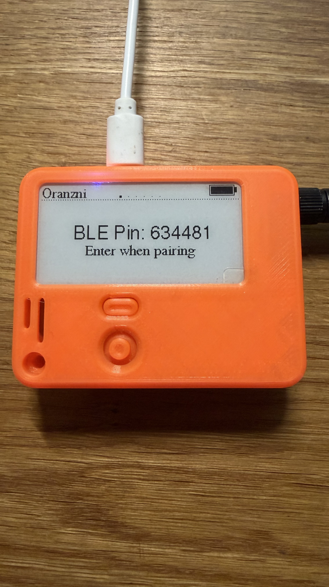
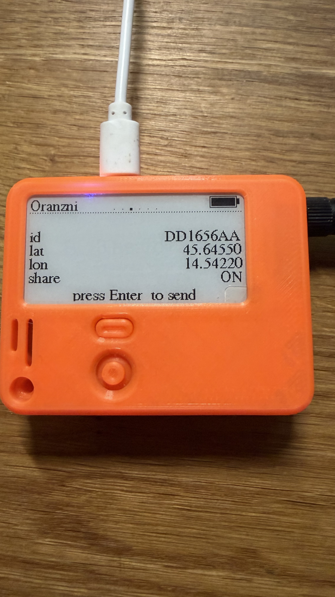
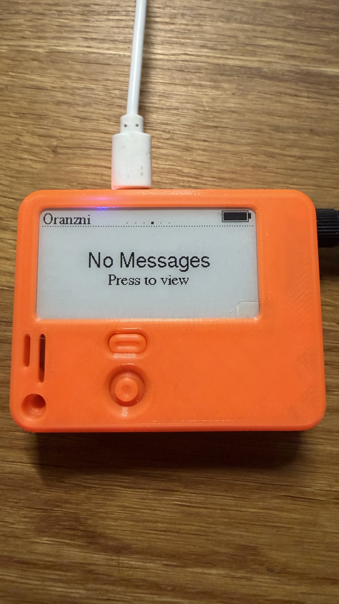
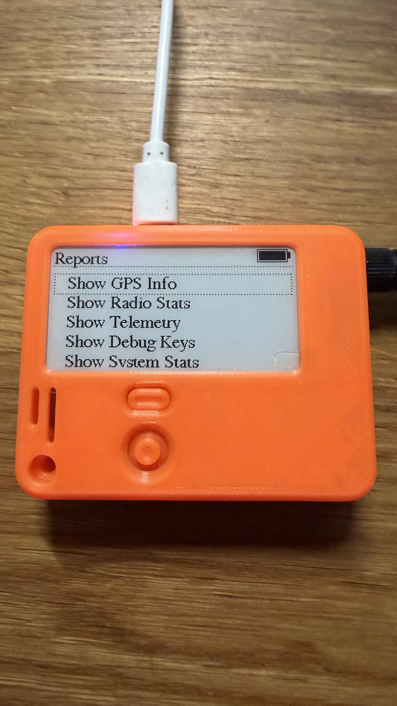

The client interface takes inspiration from **Meshtastic InkHUD** and adapts it for MeshCore with a cleaner, more operational display:

- **Improved navigation** with redesigned screens for Messages, Contacts, and Settings
- **Multi-language support** — including Slovenian and Croatian
- **Better visual hierarchy** with clearer typography and screen layout
- **Enhanced GPS display** showing both fix age and accuracy

### Reliability Improvements
**Watchdog timer implementation** helps devices stay operational when teams are under pressure:
- **Automatic recovery** from software freezes
- **NRF52 hardware watchdog** to prevent lockups
- **Continuous operation** in harsh field conditions
- **No manual intervention** after common crashes

Together, these changes make client devices more dependable during long SAR operations where failures are expensive.

### Project Repository
Find the source, releases, and implementation details at:  
**[github.com/dz0ny/meshcore-sar](https://github.com/dz0ny/meshcore-sar)**

---

## Messages

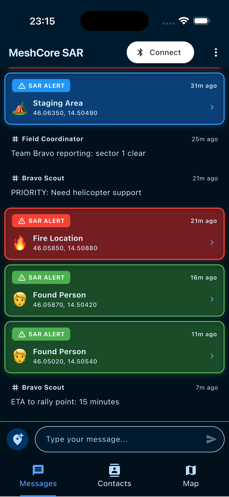
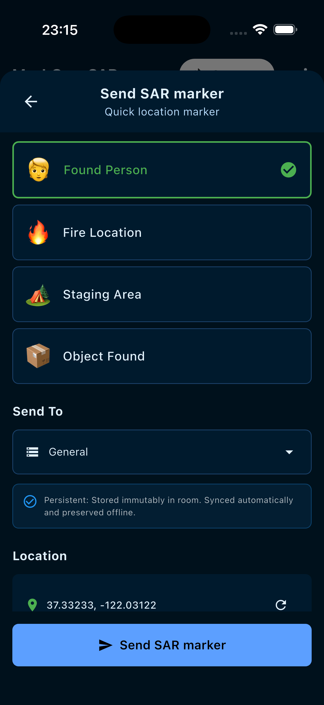
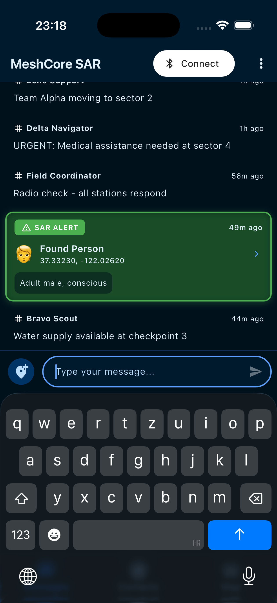

### Mission Communication
- **Direct Messages** – private one-to-one coordination  
- **Public Channels** – broadcast updates across the network  
- **Rooms** – persistent shared logs (e.g., *General*, *Emergency*)  

### SAR Marker Messages
Send geo-tagged alerts in seconds:  
*Found Person* • *Fire Location* • *Staging Area* • *Object Found*

Messages appear directly on the map with delivery states such as Sent, Delivered, Retrying, and Failed.

---

## Contacts

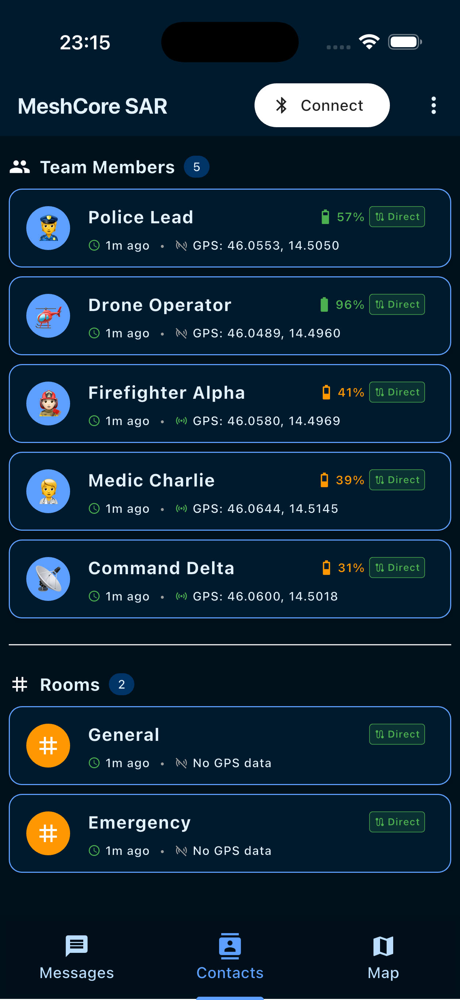
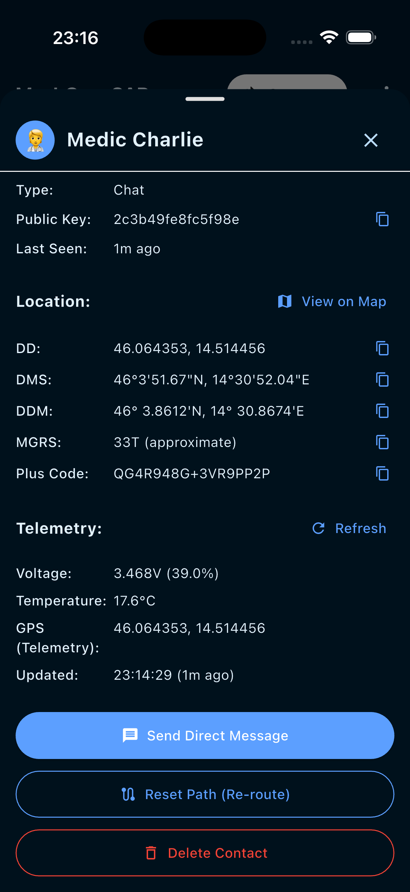
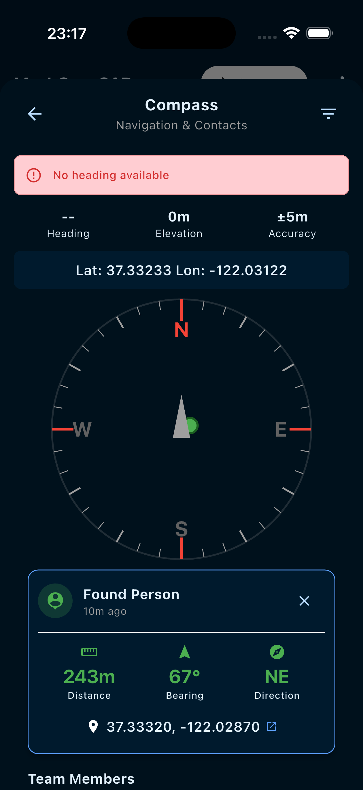

### Situational Awareness
- Real-time **GPS**, **bearing**, and **distance** for each teammate  
- **Battery telemetry** and **voltage readings**  
- **Routing path** indicator (Direct / Multi-hop / Flood)  
- **Role badges** for fast visual identification (Police, Firefighter, Medic)  
- Compass guidance for nearby contacts and SAR markers  

---

## Map

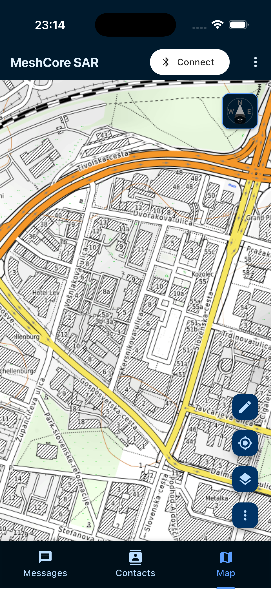
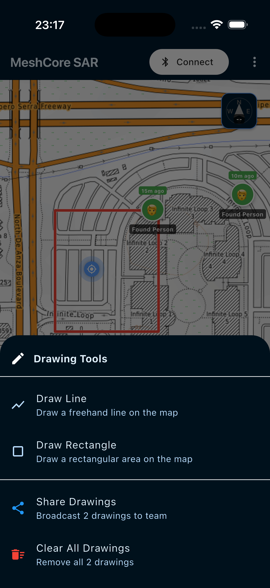
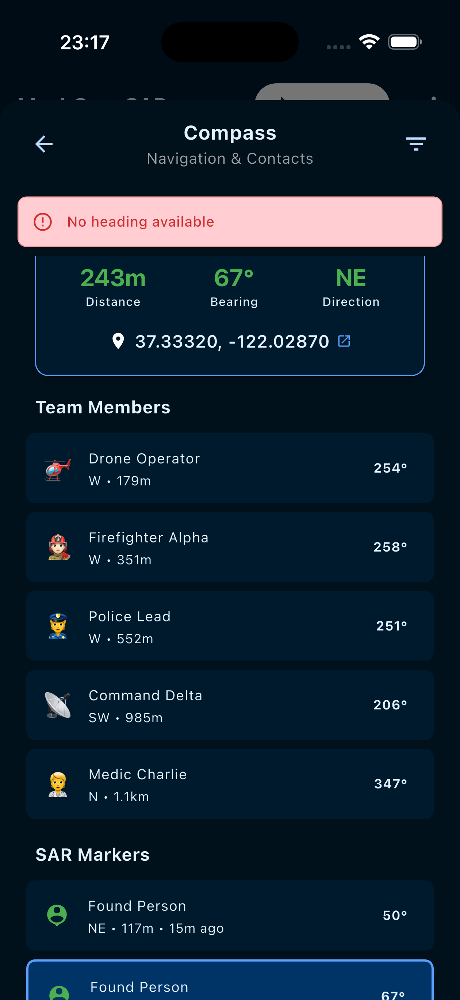

### Tactical Display
- **Offline vector maps (MBTiles)** with street, topo, and satellite layers  
- **SAR event markers** — color-coded by type  
- **Drawing tools** for routes, sectors, and quick visual planning  
- **Compass integration** — precise direction and range to people, markers, and nodes  

Plan, navigate, and coordinate without relying on network infrastructure.

---

## FAQ

### **Q: Is this a fork of MeshCore?**
**A:** No. MeshCore SAR is a specialized **application** built to work with existing MeshCore infrastructure and devices. Messages remain ASCII-only and human-readable; the app adds SAR-focused workflows and interface layers around those message formats.

### **Q: Can I use existing MeshCore repeaters in my area?**
**A:** Yes. MeshCore SAR can operate on any existing MeshCore network as long as your team has the correct frequency and configuration.

### **Q: What if there are no repeaters nearby?**
**A:** You can still communicate device-to-device, but range will be more limited. Even a single repeater can improve coverage and reliability for the whole group.

### **Q: How does this work with SAR teams that have their own equipment?**
**A:** Teams can deploy their own MeshCore infrastructure, integrate with an existing network, or combine both approaches depending on the mission area.

### **Q: Will SAR features be merged into the main MeshCore app?**
**A:** The messaging model stays compatible, but SAR-specific features such as offline maps, tactical drawing, and compass navigation are better served by a dedicated application.

---

## Download

Explore MeshCore SAR on GitHub:

**Source, releases, and project updates**  
[View on GitHub](https://github.com/dz0ny/meshcore-sar)
